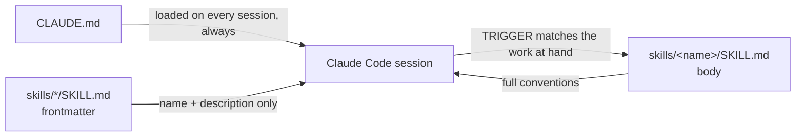

# Architecture

## Overview

This repository is the content of `~/.claude`, the directory Claude Code reads
its configuration from. It is not a program: there is nothing to build and
nothing to run. Its structure exists to control **what reaches the model's
context, and when** — a small always-loaded core of rules, and a larger body of
conventions that stays out of context until the work touches it.

## Components

**`CLAUDE.md`** — the always-loaded core. It carries only what would be
dangerous to miss if a skill failed to load: the non-negotiable rules,
the negative guardrails (never link outside the project, never leak a secret,
never commit unasked), and an index naming every skill. It owns no detailed
convention; each one is delegated to a skill and referenced by name. Its size
is a direct tax on every single session, which is why it holds meta-rules
rather than rules.

**`skills/<name>/SKILL.md`** — one self-contained convention document per
topic. The YAML frontmatter carries `name` and a `description` that states, in
prose, the `TRIGGER` conditions that should load the skill and the `SKIP`
conditions where it is irrelevant. Only that frontmatter is in context by
default; the body is pulled in when the description matches the work.

**`.gitignore`** — an allow-list. `~/.claude` is Claude Code's live runtime
home and accumulates credentials, session transcripts, history, caches,
plugins and telemetry alongside the tracked files. The file therefore ignores
`/*` and re-includes the handful of paths that belong in the repository. This
is the inverse of the usual approach and it is deliberate: a deny-list would
have to be extended every time Claude Code writes a new kind of state, and the
failure mode of forgetting is a leaked credential.

## Data flow

A session loads `CLAUDE.md` in full, plus the `name` and `description` of every
skill. Everything else is dormant. When the work matches a skill's `TRIGGER`
prose — a file path being edited, a topic in the request — that skill's body is
loaded and applies for the rest of the session.

This makes the `description` the single most important line in a skill: it is
the only part of the skill that is *always* read, and the only thing the
routing decision has to go on. A skill whose triggers are vague is a skill that
does not load, and a convention that does not load does not exist.

## Design decisions

**Conventions live in skills, not in `CLAUDE.md`.** Inlining them would put
every rule for every technology into every session, most of it irrelevant. The
split trades a routing risk (a skill that fails to trigger) for a context cost
that would otherwise be paid unconditionally. `CLAUDE.md` absorbs that risk by
keeping the rules whose absence is unrecoverable.

**A skill that outgrows its budget is split into a sibling skill, not into
`references/`.** The Agent Skills spec allows a skill to carry supporting files
under `references/`, loaded on demand from a pointer in `SKILL.md`. That
mechanism is rejected here: a `references/` file is only read if the agent
chooses to open it, so the content becomes advisory. A sibling skill has its
own `TRIGGER` and is loaded by the same automatic mechanism as any other, which
keeps the guarantee. `rust-conventions` and `rust-http-conventions` are the
worked example — the HTTP stack is ~1500 tokens that only matter when there is
an HTTP surface, and it loads on its own triggers when there is one.

**A skill body stays under 5000 tokens.** Past that the skill starts crowding
out the conversation it is supposed to inform, and the recommendation is
enforced rather than advisory: `skill-validator` fails on it, so the split
happens when the skill grows rather than a year later.

**Skill descriptions are folded block scalars (`description: >-`).** The
descriptions embed `TRIGGER when:` and `SKIP when:` markers, and a `:` inside a
multi-line plain scalar is not parseable YAML — Claude Code's own frontmatter
reader is lenient about it, strict parsers are not. The block scalar is what
makes the same text valid for both.

## Invariants and constraints

- **`CLAUDE.md` names every skill in `skills/`, and names nothing else.** The
  index is how a skill is discoverable when its triggers do not fire; a skill
  missing from it is invisible, and an entry pointing at a renamed skill is
  worse than no entry.
- **Every `SKILL.md` frontmatter parses as strict YAML**, and its `description`
  states both when to load and when to skip.
- **Every tracked path is explicitly re-included in `.gitignore`.** A new file
  at the repository root is ignored until it is allowed back, by construction.
- **Documentation describes the present.** No status, no roadmap, no dated
  narrative — the constraint `CLAUDE.md` imposes on every project applies to
  this one. `docs/adr/` and a changelog would be the exceptions; neither
  exists here.

## Limitations

**Skill loading is a routing decision, not a guarantee.** A convention applies
only if its `TRIGGER` prose matches the work well enough for the skill to be
selected. Sharpening a description is the only lever; there is no mechanism to
force a skill to load for a given file pattern.

**The configuration is single-user.** Paths, the git remote and the install
instructions assume one person's `~/.claude` on their own machines. Sharing a
subset of these skills with a team would mean extracting `skills/` into its own
distributable repository, since a consumer cannot take the skills without also
taking `CLAUDE.md`'s rules.

**Nothing verifies that a convention is followed.** The checks in this
repository assert that a skill is well-formed, well-sized and internally
consistent — not that the model applied it in some other project. That feedback
only exists in the projects themselves, through their own linters and CI.
